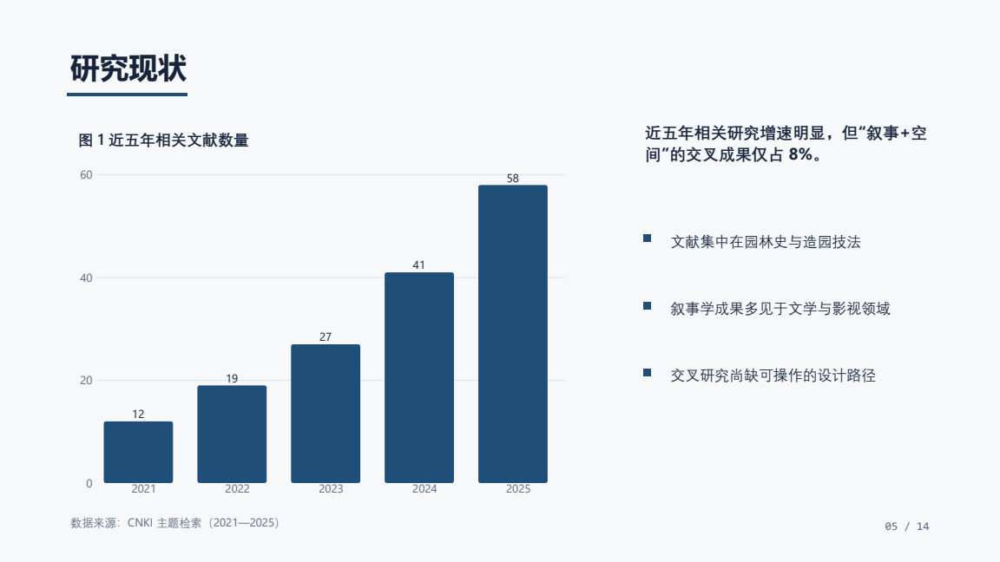
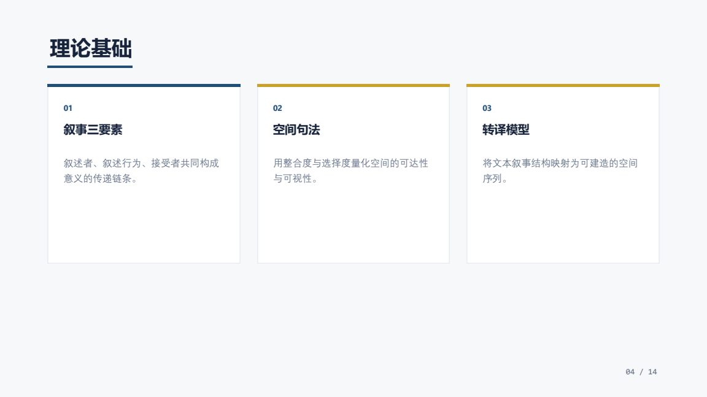
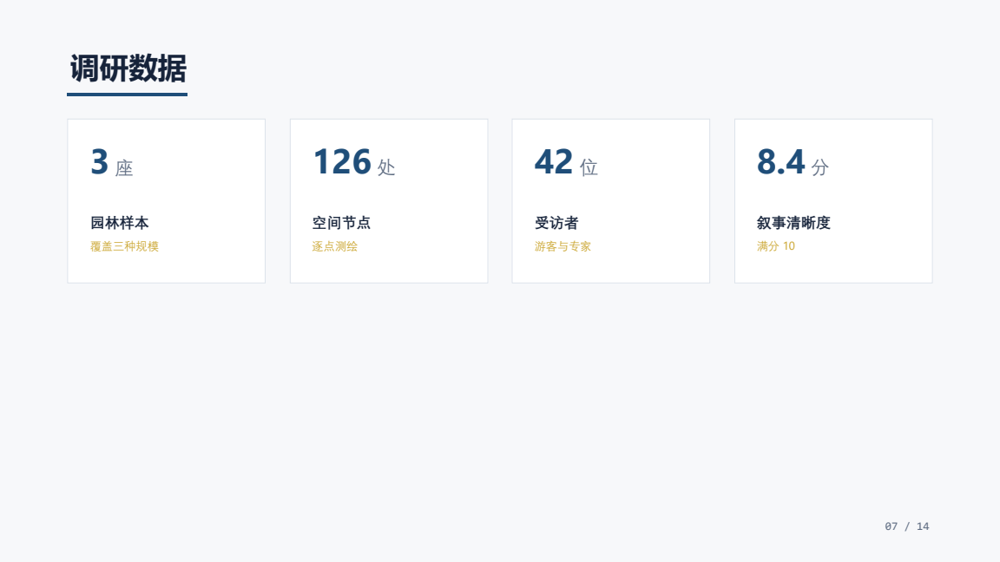

# pptx-studio

> **用 HTML 工作流做 PPT**：内容写进 `deck.json` → 浏览器里预览并随手改 → 导出**完全可编辑**的 PPTX。
> 也能反向工作：读取已有 `.pptx`、在保留原格式的前提下修改、把内容搬到新模板上重排。

`pptx-studio` 是一个 ZCode / Claude Code 风格的 **Skill（技能）**：把一整套演示文稿工作流交给 agent 使用，
自己也可以在浏览器里直接改。所有处理都在本地完成，不上传任何内容。






## 它能做什么

| 你想做的事 | 路线 | 命令 |
|---|---|---|
| 做个 PPT / 把内容整理成幻灯片 | **生成** | `demo` / `init` → 写 `deck.json` → `validate` → `render`/`preview` → `build` |
| 这份 PPT 里有什么 / 分析它的排版配色 | **解析** | `inspect --outline` / `inspect --json` |
| 改文字、备注、删几页，**别动我的排版** | **原地编辑** | `edit`（保留原格式，只动指定内容） |
| 重排、统一视觉、加图表，还要能预览 | **转模型再生成** | `to-deck` → 浏览器编辑 → `build` |
| 套用学校/单位模板 | **套模板** | `apply-template`（或 `build --base`） |
| 要预览、还要能导出可编辑 PPTX | **生成 + 预览服务** | `preview` |

导出的 PPTX 里，文字是**真文本**（同时写入 `a:latin` 与 `a:ea` 字体，中文不会退化成宋体）、
形状是原生自选图形、表格是原生表格、图表是**可"编辑数据"的原生图表**、备注写在备注页里 ——
**没有任何东西被拍平成图片**。

## 安装

需要 Python 3.10+（已在 3.14 上验证）。三种装法，任选其一。

**方式一：作为 Skill 目录（最简单）**

```bash
git clone https://github.com/zhouyiyulibaitian/zcode-pptx-skill.git
cp -r zcode-pptx-skill/skills/pptx-studio ~/.agents/skills/
# Windows: xcopy /E /I zcode-pptx-skill\skills\pptx-studio %USERPROFILE%\.agents\skills\pptx-studio
```

装好后重开会话，Skill 会在你说"做个 PPT""改一下这份 PPT""套用这个模板"时自动触发。

**方式二：作为 ZCode 插件**

仓库根目录已包含 `.zcode-plugin/plugin.json`，把仓库目录放到插件目录下即可：

```
~/.zcode/cli/plugins/cache/<your-marketplace>/pptx-studio/<version>/
```

**方式三：作为 marketplace 添加**

仓库根目录包含 `.claude-plugin/marketplace.json`，可作为 marketplace 添加后安装 `pptx-studio`。

**Python 依赖**

```bash
pip install python-pptx pypdfium2
```

| 依赖 | 用途 | 是否必需 |
|---|---|---|
| `python-pptx` | 读写 PPTX、导出原生图表/表格/备注 | **必需** |
| `Pillow` | 读取图片尺寸（按比例裁切） | 随 python-pptx 自动安装 |
| `pypdfium2` | `shots` 命令把每页导成 PNG 自查 | 可选 |
| Chrome / Edge | 导出 PDF（无头打印） | 导出 PDF 时需要 |

没有 LibreOffice 也能用：PDF 由无头浏览器生成，不需要 Office。

## 快速开始

```bash
S="skills/pptx-studio/scripts/studio.py"

# 1. 生成一份覆盖全部版式的示例，直接改内容
python "$S" demo --out work/deck.json --theme ink --title "我的汇报"

# 2. 校验（结构 + 溢出），必须 0 error
python "$S" validate --deck work/deck.json

# 3. 浏览器里预览并随手改（拖动/改字/改样式/加备注/换主题）
python "$S" preview --deck work/deck.json --port 5390
#   编辑界面 http://127.0.0.1:5390/   放映预览 http://127.0.0.1:5390/preview

# 4. 导出完全可编辑的 PPTX 与 PDF
python "$S" build --deck work/deck.json --out work/汇报.pptx --transition fade
python "$S" pdf   --deck work/deck.json --out work/汇报.pdf
```

改一份已有的 PPT：

```bash
python "$S" inspect 原稿.pptx --outline                     # 先看清结构
python "$S" edit 原稿.pptx --out 改后.pptx \
       --replace "2024年=2025年" --notes-index 2 --notes "讲稿…" \
       --delete-slide 6 --duplicate-slide 1 --extract-images imgs/
```

套用模板：

```bash
# PowerPoint 里最像模板（沿用模板母版/版式/校徽页脚）
python "$S" apply-template 内容.pptx --template 学校模板.pptx --out 答辩.pptx --mode layout
# HTML 预览与导出完全一致（借用模板配色字体，用内置版式重排）
python "$S" apply-template 内容.pptx --template 学校模板.pptx --out 答辩.pptx --mode theme
```

## 命令一览

| 命令 | 作用 |
|---|---|
| `themes` / `layouts` | 列出内置主题 / 版式及其字段 |
| `demo` / `init` | 生成示例 deck / 新建最小 deck |
| `validate` | 校验结构、几何越界、文字溢出（`--theme` 可换主题验证） |
| `resolve` | 把 `layout + content` 展开成显式元素，便于检查真实坐标 |
| `render` | 渲染静态 HTML 预览 + 可编辑版本 |
| `preview` | 起本地服务：浏览器编辑 + 一键导出 PPTX/PDF |
| `build` | 导出可编辑 PPTX（`--base 模板.pptx` 可套模板母版） |
| `pdf` / `shots` | 导出 PDF / 每页导出 PNG（自查用） |
| `inspect` | 分析已有 PPTX（`--outline` 人读 / `--json` 机器读） |
| `to-deck` | 已有 PPTX → 可预览可编辑的 deck |
| `edit` | 在保留格式的前提下修改已有 PPTX |
| `template` | 从 PPTX/模板提取主题（字体、配色、字号） |
| `apply-template` | 把已有 PPT 的内容套到指定模板上重排 |

## 工作原理

```
deck.json  ──►  resolve_deck()  ──┬──►  HTML 预览 / 浏览器编辑  ──┐
（唯一事实源）   layout + content  │                              │ patch 回写
                                  └──►  build()  ──►  PPTX        │
                                                          ◄──────┘
```

三个关键设计：

1. **`deck.json` 是唯一事实源。** HTML 预览、浏览器编辑、PPTX 导出、PDF 导出全都从它出发，
   不会出现"网页上好看、导出来不一样"的漂移。
2. **几何用英寸存储，HTML 按 96 dpi 渲染。** 预览与导出的一致性是**构造保证**的，
   不是靠测量 DOM 猜出来的。文字用 `pt → px × 4/3`，与 PowerPoint 的比例一致。
3. **编辑器改的是服务端渲染出来的 DOM**，然后把几何/文字/样式等 patch 回传给本地服务写回 `deck.json`，
   JavaScript 侧没有第二套渲染实现。

17 种内置版式（封面、目录、要点、卡片、指标、图文、满版图、引言、图表、表格、时间线、对比、
大数字、章节页、结束页…）× 4 套主题（瑞士网格 / 深墨商务 / 科技渐变 / 纸感学术），
版式会自动收缩字号避免溢出；也可以把任意 PPTX 提取成主题来用。

## 目录结构

```
zcode-pptx-skill/          # 仓库根（插件根）
├── .zcode-plugin/plugin.json         # ZCode 插件清单
├── .claude-plugin/marketplace.json   # marketplace 清单
├── docs/sample/                      # README 用的示例产物
└── skills/pptx-studio/
    ├── SKILL.md                      # 技能说明（agent 读这个）
    ├── references/                   # deck.json 格式 / 已有 PPTX 处理 / 自查清单
    ├── assets/                       # 主题定义 + 浏览器编辑器（前端）
    └── scripts/
        ├── studio.py                 # 命令行入口
        └── lib/                      # model / layouts / html_render / pptx_build / pptx_ops / svgchart / serve
```

## 已知边界（诚实说明）

- `to-deck` 的转换**是有损的**：SmartArt、3D、艺术字、OLE、音视频不会转换；组合形状会被拍平为绝对坐标；
  未直接写在 run 上的继承样式会退化为默认值。转换时会把这些问题作为 `warnings` 报出来，不会静默丢弃。
- `apply-template --mode layout` 保留模板母版，因此 **PowerPoint 里最像模板**，但此时 HTML 预览展示的是
  本工具的版式（内容一致、装饰不同）；要"预览与导出一致"就用 `--mode theme`。
- 依赖本机字体。跨设备稳妥选择：微软雅黑 / 等线 / Arial / Georgia。
- 字体在浏览器和 PowerPoint 中的换行位置不可能 100% 相同，本工具用相同的磅值与行距把差异控制在最小，
  并用 `validate` 与编辑器里的"溢出检查"提示可能的问题。

## 开发与自检

```bash
python "$S" demo --out /tmp/d/deck.json
python "$S" validate --deck /tmp/d/deck.json      # 必须 0 error
python "$S" shots    --deck /tmp/d/deck.json      # 出图，自己看一眼
python "$S" inspect  /tmp/d/o.pptx                # 回读导出结果，确认没丢东西
```

`docs/sample/` 里的示例内容（人名、数据、文献数量）都是**虚构的演示数据**，不要当作真实研究结果引用。

## 参考与致谢

架构思路参考了 [chuspeeism/dashi-ppt-skill](https://github.com/chuspeeism/dashi-ppt-skill)
（内容包 → 版式驱动页面 → 本地服务负责编辑与导出）与
[pipipi-pikachu/PPTist](https://github.com/pipipi-pikachu/PPTist)
（用 JSON 描述幻灯片、再导出 PPTX 的模型）。本仓库的代码与文档为独立实现，未包含上述项目的代码或素材。

## License

MIT
